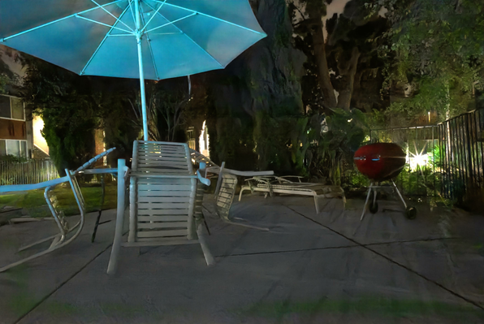
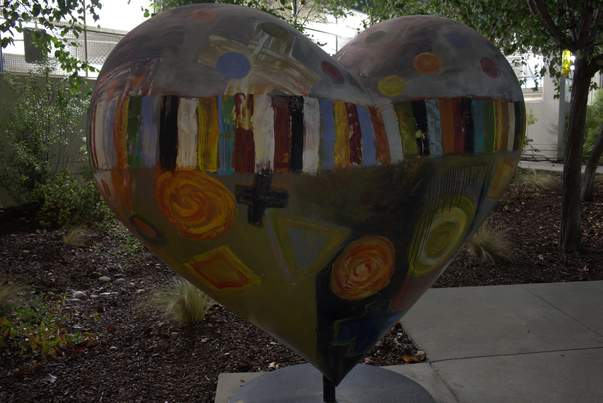

## Learning to See in the Dark in PyTorch.

This repo implements `Learning to See in the Dark` models presented in [1].


### Test(Inference)

Usage: 
```bash
python demo.py test <options>
```

In order to use pretrained models by authors of [1], which are trained using TensorFlow,
specify a converted pretrained model file(see [here](#pretrained-models)) to `--tf_weight_file`.

If you use trained models by this repo, specify model files to `--resume` option.

  * `--tf_weight_file` authors' TensorFlow models(see [here](#pretrained-models))
  * `--resume` trained models by this repo

### Training

Usage: 
```bash
python demo.py train <options>
```

#### Options

* `cmd` specifies `train`(training) or `test`(inference)
* `--arch_type` camera model type (default: `Sony`): 
    - `Sony` for Sony camera(Sony alpha 7S II)
    - `Fuji` for Fujifilm camera(Fujifilm X-T2)
* `--dataset_dir` dataset directory(default: `./dataset/`)
* `--tf_weight_file` weight file converted from authors' TensorFlow models(see [here](#pretrained-models))(default: ``)
* `--resume` If set, checkpoint file used in `train` or `test` for PyTorch (default: `./checkpoint/Sony/`)
* `--checkpoint_dir` checkpoints directory (default: `./checkpoint/Sony/`)
* `--result_dir` directory where results are saved (default: `./result/Sony/`)
* `--train_img_list_file` text file containing image file names for training
* `--valid_img_list_file` text file containing image file names for validation
* `--test_img_list_file` text file containing image file names for test
* `--log_file` log file (default: `./log/Sony/test.log`)
* `--gt_png` If set, provided png images, converted from RAW format to png, are used as ground truth
* `--batch_size` batch size in training(default: 1)
* `--valid_batch_size` batch size in validation (default: 1)
* `--test_batch_size` batch size in test (default: 1)
* `--patch_size` patch size in training (default: None)
* `--save_freq` checkpoint save frequency (default: 1)
* `--print_freq` log print frequency (default: 1)
* `--gpu` GPU devide id (default: 0)
* `-j` or `--workers` number of data loading workers (default: 4)
* `-c` or `--config` configuration number(in which hyperparameters in training are set)

### Pretrained models

The following weight files are models converted from 
[authors' TensorFlow models](https://github.com/cchen156/Learning-to-See-in-the-Dark) listed in the first two rows,
and models trained from scratch by codes in this repo(third row).
I converted the authors TensorFlow checkpoint files to pickle format to load their weight values into PyTorch models. 

|camera|download link|memo|
| :--- | :---: | :---: |
|Sony|[link](https://drive.google.com/open?id=1ZccOIyp674cVIDrEQnUGcd2effZeu5FO)|converted from TensorFlow model|
|Fuji|[link](https://drive.google.com/open?id=1Gl453ex_ADbrQiDowCZYveHWXug-Rcsl)|converted from TensorFlow model|
|Sony|[link](https://drive.google.com/open?id=1iEdL_zGrtVkfTEATKqmi4BPxzT-o3NFN)|trained model using this repo from scratch|
|Fuji|- | not trained by this repo|


### Dataset

To download datasets by Sony and Fuji cameras, see [authors' site](https://github.com/cchen156/Learning-to-See-in-the-Dark).

### PSNR/SSIM results

Table below shows PSNR and SSIM results using converted authors' TensorFlow models and a trained model by codes in this repo.
Two types of test data are used:
  * "all": all RAW test files are used. These files are listed in `Sony_test_list.txt` and `Fuji_test_list.txt` 
    which are contained in dataset.
  * "00 only": as written in [here](https://github.com/cchen156/Learning-to-See-in-the-Dark#dataset) 
    "00" means the number in the sequence/burst in the RAW file names like `./Sony/short/10003_00_0.04s.ARW`.

|model|test data|Sony|Fuji|
| :--- | :---: | :---: | :---: |
|paper[1]|-|28.88/0.787|26.61/0.680|
|converted from TensorFlow|all|28.88/0.7980(598)|27.01/0.7241(524)|
|converted from TensorFlow|00 only|28.59/0.7831(93)|26.61/0.7040(94)|
|trained from scratch|all|28.55/0.7878(598)|-|
|trained from scratch|00 only|28.25/0.7721(93)|-|

### Some Results

#### Sony

Camera: Sony a7S II

Info: ISO-2000 f/9 1/10s

Ground truth(RAW: Sony/long/10106_00_30s.ARW)


converted TensorFlow model(RAW: Sony/short/10106_00_0.1s.ARW)



PyTorch model trained from scratch(RAW: Sony/short/10106_00_0.1s.ARW)


#### Fuji

Camera: Fuji X-T2

Info: ISO-800 f/7.1 1/30s

Ground truth(RAW: Fuji/long/10068_00_10s.RAF)



converted TensorFlow model(RAW: Fuji/short/10068_00_0.1s.RAF)


## References

1. Chen, C., Chen, Q., Xu, J., & Koltun, V. (2018). Learning to See in the Dark. arXiv preprint arXiv:1805.01934.  
    [arXiv](https://arxiv.org/abs/1805.01934), [github](https://github.com/cchen156/Learning-to-See-in-the-Dark),
    [Project Website](http://cchen156.web.engr.illinois.edu/SID.html)
